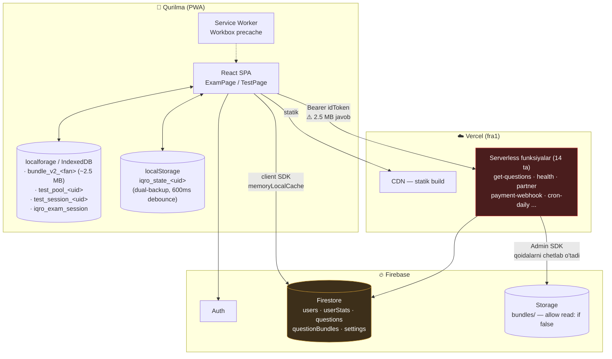
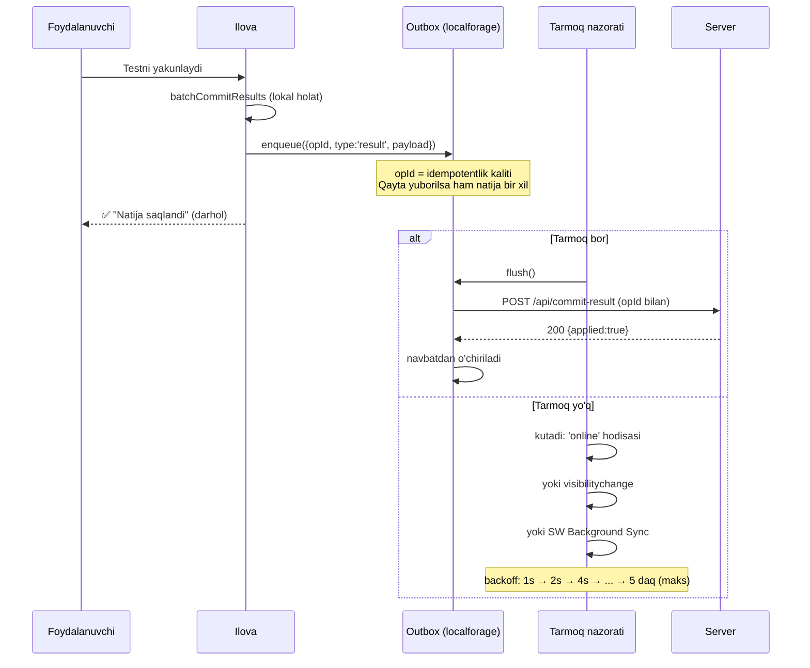
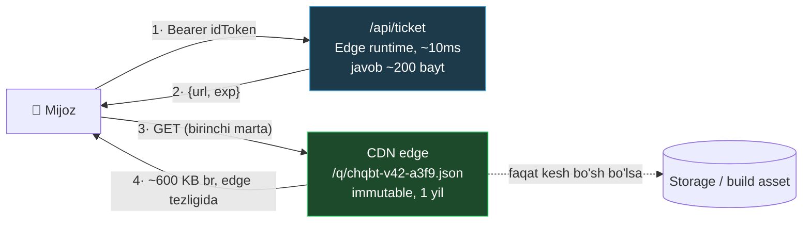
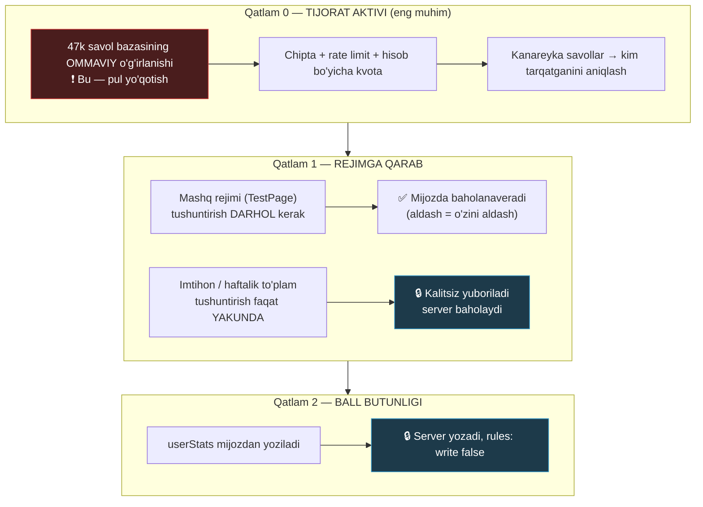

# Zehin — texnik barqarorlik auditi (High-Load & Resilience)

**Sana:** 2026-08-17
**Qamrov:** offline chidamlilik, uzilish/qulash ssenariylari, yuk ostidagi xatti-harakat, anti-cheat
**Usul:** faqat repodagi haqiqiy kod. Har bir da'vo fayl:qator bilan bog'langan.
**Bog'liq hujjatlar:** [YUK_VA_BARQARORLIK.md](YUK_VA_BARQARORLIK.md) (kvota/narx), [AUDIT_2026-08-17_MAHSULOT.md](AUDIT_2026-08-17_MAHSULOT.md) (mahsulot)

---

## 0. Qisqacha xulosa

Platforma **kutilganidan ancha yaxshi holatda**. Offline saqlash, deadline asosidagi
taymer, dual-backup, monoton merge, paket keshi — bularning hammasi allaqachon bor va
to'g'ri yozilgan. Bu audit noldan arxitektura chizmaydi; **mavjud arxitekturadagi 8 ta
aniq teshikni** ko'rsatadi.

Eng muhim ikki gap:

1. **Ma'lumot yo'qolishi xavfi hali bor, lekin u siz o'ylagan joyda emas.** Javoblar
   ishonchli saqlanadi. Yo'qoladigan narsa — **yakunlangan natija** (tarmoq bo'lmasa) va
   **haftalik diagnostika yozuvi** (merge'da umuman yo'q).
2. **50 000 bir vaqtda — hozirgi arxitekturada mumkin emas.** Firestore emas, Firestore
   narxi ham emas. To'siq — `/api/get-questions` orqali har bir foydalanuvchiga
   **2.5 MB serverless funksiya ichidan** uzatilishi. Bu qismni CDN ga o'tkazmasdan
   boshqa hech qanday optimizatsiyaning ma'nosi yo'q.

### Xavflar jadvali

**Holat 2026-08-17 kechqurun:** 8 tadan **7 tasi tuzatildi**, audit davomida yana
**2 ta yangi nuqson** topilib (X-9, X-10) ular ham yopildi. Batafsil: [6-bo'lim](#6-bajarilgan-ish-2026-08-17).

| # | Nuqson | Daraja | Ta'sir | Holat |
|---|---|---|---|---|
| **X-1** | Bulutga yozuv tasdiqlanmaydi, qayta urinish yo'q | 🔴 KRITIK | Foydalanuvchi "natijam yo'qoldi" deydi | ✅ **Tuzatildi** (qisman — 6.2 ga qarang) |
| **X-2** | `partnerSets` `mergeCloudAndLocal` da umuman yo'q → bulut nusxasi g'olib | 🔴 KRITIK | Haftalik diagnostika natijasi yo'qoladi + keyingi hafta ochilmaydi | ✅ **Tuzatildi** |
| **X-3** | 50k foydalanuvchi = 125 GB paket serverless funksiya orqali | 🔴 KRITIK | Imtihon kunida ilova ochilmaydi | ⏸ **Qoldirildi** — 6.3 ga qarang |
| **X-4** | Muddati o'tgan imtihon sessiyasi jimgina o'chiriladi | 🟠 YUQORI | 45 ta javob izsiz yo'qoladi | ✅ **Tuzatildi** |
| **X-5** | To'g'ri javoblar (`correct`) mijozga to'liq yetkaziladi | 🟠 YUQORI | Ball/reyting butunligi yo'q | ⏸ **Qoldirildi** — 6.3 ga qarang |
| **X-6** | `/api/get-questions` da rate limit YO'Q — eng qimmat endpoint | 🟠 YUQORI | Bitta hisob bilan bazani so'rib olish | ✅ **Tuzatildi** |
| **X-7** | `ExamPage` har javobda butun savollar massivini IndexedDB ga yozadi | 🟡 O'RTA | Jank + `memoryLocalCache` ga sabab bo'lgan bosim | ✅ **Tuzatildi** |
| **X-8** | `/api/send-result` mavjud emas, `ExamPage` unga so'rov yuboradi | 🟡 O'RTA | Har imtihon yakunida behuda 404 | ✅ **Tuzatildi** |
| **X-9** | Dashboard "Davom etish" banneri **o'lik** — eski `timeLeft` formatiga bog'langan | 🟠 YUQORI | Tugallanmagan imtihonga qaytishning asosiy yo'li ishlamaydi | ✅ **Tuzatildi** |
| **X-10** | Dashboard'da T-21 maxfiylik teshigi qolgan (uchinchi takror) | 🟠 YUQORI | Umumiy qurilmada begona sessiya ko'rinadi | ✅ **Tuzatildi** |

---

## 1. Hozirgi arxitektura



**Kuchli tomonlari (audit tasdiqladi):**

- Serverli monolit yo'q → RAM/CPU tugab qotib qoladigan qatlam ham yo'q.
- Savollar paketi maxfiy Storage'da, mijozga havola **umuman berilmaydi**
  ([api/get-questions.js:168](api/get-questions.js#L168)).
- Firestore keshi ataylab **xotirada** — IndexedDB nosozliklari sababli
  ([src/firebase.js:62](src/firebase.js#L62)). Bu to'g'ri qaror va uni qaytarmaslik kerak.
- Natija test yakunida **bitta** yozuvda ketadi (`batchCommitResults`), 50 write → 1 write.

---

## 2. Aloqa uzilishi va offline rejim

### 2.1. Hozir nima ishlaydi — tekshirildi ✅

**Savol #1: "har bir javob darhol lokal xotiraga saqlanishi kerak" — bu allaqachon bor.**

| Qatlam | Fayl | Mexanizm |
|---|---|---|
| Imtihon javobi | [ExamPage.jsx:280](src/pages/ExamPage.jsx#L280) | `useEffect(persist, [answers, flagged, currentQ])` — har javobda |
| + fon/qulflash | [ExamPage.jsx:283](src/pages/ExamPage.jsx#L283) | `visibilitychange` → darhol yozuv |
| + xavfsizlik to'ri | [ExamPage.jsx:285](src/pages/ExamPage.jsx#L285) | har 30 soniyada interval |
| Test javobi | [TestPage.jsx:216](src/pages/TestPage.jsx#L216) | debounced yozuv, ~2–5 KB |
| Profil/progress | [AppContext.jsx:654](src/context/AppContext.jsx#L654) | localStorage 600ms + localforage |
| Bulutga | [AppContext.jsx:658](src/context/AppContext.jsx#L658) | Firestore 3s debounce + `visibilitychange` flush |

Bu — sanoat standarti darajasidagi yechim. **Bu qismga tegish kerak emas.**

### 2.2. 🔴 X-1 — KRITIK: yakunlangan natija uchun navbat (outbox) yo'q

**Mexanizm:**

```
Foydalanuvchi metroda test yakunlaydi (tarmoq yo'q)
  → batchCommitResults() → setState
  → 3s debounce → setDoc(userStats/uid)   ← Firestore SDK NAVBATGA QO'YADI
  → navbat XOTIRADA (memoryLocalCache — firebase.js:63)
  → foydalanuvchi ilovani yopadi
  → ❌ navbat yo'qoladi. Yozuv HECH QACHON ketmaydi.
```

`setDoc(...).catch(console.error)` — [AppContext.jsx:642](src/context/AppContext.jsx#L642).
`await` yo'q, muvaffaqiyat tekshirilmaydi, qayta urinish yo'q.

**Nega hozircha portlamagan:** `mergeCloudAndLocal` monoton `max()` qiladi
([AppContext.jsx:214](src/context/AppContext.jsx#L214)), ya'ni **hisoblagichlar**
keyingi kirishda lokal zaxiradan tiklanadi. Bu tasodifiy emas, ataylab qilingan va yaxshi.

**Lekin u faqat `max()` qilinadigan maydonlarni qutqaradi.** `max()` ro'yxatida
bo'lmagan hamma narsa yo'qoladi — pastdagi X-2 aynan shuning misoli.

**Qo'shimcha xavf:** `memoryLocalCache` da SDK navbati ilova ochiq turgan vaqtdagina
yashaydi. Ya'ni "offline yozuv keyin o'zi ketadi" degan kafolat **yo'q**.

### 2.3. 🔴 X-2 — KRITIK: `partnerSets` merge'da umuman yo'q

Bu X-1 ning haqiqiy, o'lchanadigan oqibati.

`ExamPage` haftalik diagnostika natijasini shunday yozadi
([ExamPage.jsx:853](src/pages/ExamPage.jsx#L853)):

```js
if (examType === 'weekly' && selectedSetId && !state.partnerSets?.[selectedSetId]) {
  updateState({ partnerSets: { ...(state.partnerSets || {}), [selectedSetId]: {...} } });
}
```

Kod izohi bu yozuvning ahamiyatini o'zi aytadi:

> *"Shu yozuv AYNI PAYTDA keyingi haftani ochadigan kalit ham"*

Endi `mergeCloudAndLocal` ga qarang — `spacedCards`, `customMnemonics`,
`readinessHistory`, `activeDays`, `achievements`, `milestones`, `amiWeekly` uchun
alohida birlashtirish mantiqi bor. **`partnerSets` uchun yo'q.** Funksiya
`merged = { ...cloud }` bilan boshlanadi ([AppContext.jsx:212](src/context/AppContext.jsx#L212)),
demak:

```
Ustoz guruhga haftalik to'plam beradi
  → o'qituvchi maktabda, Wi-Fi yo'q, mobil internet zaif
  → to'plamni yechadi, 42/50 oladi
  → natija localStorage ga tushadi, bulutga YETMAYDI
  → ilovani yopadi
  → ertasiga ochadi → mergeCloudAndLocal → cloud.partnerSets (bo'sh) G'OLIB
  → ❌ natija yo'q, ustoz hisobotida bu odam "yechmagan"
  → ❌ keyingi hafta ham ochilmaydi (kalit yo'qoldi)
```

Bu **aynan T-15 bandi** (`spacedCards`) bilan bir xil sinfdagi xato — o'sha paytda
topilgan, lekin `partnerSets` keyinroq qo'shilgani uchun merge'ga kirmay qolgan.

**Tuzatish — 1 soat.** [AppContext.jsx:265](src/context/AppContext.jsx#L265) atrofiga,
`timeStats` dan keyin:

```js
// ⚠️ AUDIT 2026-08-17, X-2 BAND — `partnerSets` BIRLASHTIRILMASDI:
// `merged = {...cloud}` tufayli bulut nusxasi g'olib edi. Oflayn yechilgan
// haftalik to'plam natijasi jimgina yo'qolardi — ustoz hisobotida odam
// "yechmagan" bo'lib ko'rinardi VA keyingi hafta ochilmay qolardi
// (ExamPage.jsx:852 — bu yozuv qulfni ochadigan kalit ham).
//
// SEMANTIKA: birinchi urinish yoziladi va O'ZGARMAYDI (ExamPage.jsx:848).
// Shuning uchun union qilinadi va ziddiyatda ERTAROQ `doneAt` g'olib bo'ladi:
// ikki qurilmada yechilgan bo'lsa ham haqiqiy birinchi urinish saqlanadi.
const setIds = new Set([
  ...Object.keys(cloud.partnerSets || {}),
  ...Object.keys(local.partnerSets || {}),
]);
if (setIds.size > 0) {
  merged.partnerSets = {};
  setIds.forEach(id => {
    const c = (cloud.partnerSets || {})[id];
    const l = (local.partnerSets || {})[id];
    if (!c || !l) { merged.partnerSets[id] = c || l; return; }
    merged.partnerSets[id] = (l.doneAt || '') < (c.doneAt || '') ? l : c;
  });
}
```

> **Umumiy qoida — buni loyiha yodda tutsin:** `mergeCloudAndLocal` ga
> **qo'shilmagan har bir yangi state maydoni — kelajakdagi ma'lumot yo'qotilishi.**
> Yangi maydon qo'shganda merge qoidasi ham yoziladi. Bu tekshiruvni PR ro'yxatiga qo'ying.

### 2.4. Background Sync algoritmi (tavsiya)

`max()` merge — aqlli yamoq, lekin u **hisoblagichlar uchungina** ishlaydi. Hodisalar
(haftalik natija, to'lov, ustozga hisobot) uchun haqiqiy navbat kerak.

**Naqsh: Outbox + idempotentlik kaliti + eksponensial backoff.**



**`src/services/outbox.js` (yangi fayl):**

```js
/**
 * outbox.js — tarmoqqa yetib bormagan HODISALARNI saqlaydigan navbat.
 *
 * ⚠️ NEGA FIRESTORE SDK NAVBATI YETARLI EMAS:
 *   firebase.js:63 da `memoryLocalCache()` — bu ataylab qilingan (IndexedDB
 *   nosozliklari 47 ta xato jurnalining sababi edi). Lekin natijasi shu:
 *   SDK ning kutilayotgan yozuvlar navbati XOTIRADA yashaydi va ilova
 *   yopilishi bilan yo'qoladi. Ya'ni "offline yozuv keyin o'zi ketadi"
 *   degan kafolat YO'Q.
 *
 *   Hisoblagichlar buni `mergeCloudAndLocal` ning monoton max() si bilan
 *   yenga oladi. HODISALAR (haftalik natija, to'lov) — yo'q. Ular shu yerda.
 */
import localforage from 'localforage';

const KEY = (uid) => `outbox_${uid}`;
const MAX_ITEMS = 100;          // navbat cheksiz o'smasin
const MAX_TRIES = 12;           // ~2 soatlik backoff, keyin "o'lik xat"
const BASE_DELAY = 1000;

const newId = () =>
  (globalThis.crypto?.randomUUID?.() ??
    `${Date.now()}-${Math.random().toString(36).slice(2)}`);

export async function enqueue(uid, type, payload) {
  if (!uid) return null;
  const q = (await localforage.getItem(KEY(uid))) || [];
  const op = { opId: newId(), type, payload, tries: 0, nextAt: 0, at: Date.now() };
  q.push(op);
  // Eng eskisi tushib qoladi — lekin bu holat jurnalga yoziladi,
  // chunki u ma'lumot yo'qotilishi demak.
  while (q.length > MAX_ITEMS) {
    const dropped = q.shift();
    console.error('Outbox to\'lib ketdi, yozuv tashlandi:', dropped.type, dropped.opId);
  }
  await localforage.setItem(KEY(uid), q);
  return op.opId;
}

/**
 * Navbatni bo'shatishga urinadi. Bir vaqtda faqat bitta flush ishlaydi
 * (`flushing` guard) — aks holda 'online' + visibilitychange bir paytda
 * kelib bitta operatsiya ikki marta yuborilardi.
 */
let flushing = false;
export async function flush(uid, getToken) {
  if (flushing || !uid || !navigator.onLine) return;
  flushing = true;
  try {
    let q = (await localforage.getItem(KEY(uid))) || [];
    if (q.length === 0) return;

    const token = await getToken();
    if (!token) return;

    const now = Date.now();
    const kept = [];
    for (const op of q) {
      if (op.nextAt > now) { kept.push(op); continue; }   // backoff hali tugamagan
      try {
        const res = await fetch(`/api/commit-${op.type}`, {
          method: 'POST',
          headers: {
            'Content-Type': 'application/json',
            Authorization: `Bearer ${token}`,
            // Idempotentlik: server shu kalitni ko'rgan bo'lsa qayta qo'llamaydi.
            'X-Idempotency-Key': op.opId,
          },
          body: JSON.stringify(op.payload),
        });
        // 2xx = bajarildi. 4xx = so'rov NOTO'G'RI — qayta urinish foydasiz,
        // tashlaymiz (aks holda navbat abadiy tiqilib qoladi). 5xx/tarmoq = qayta.
        if (res.ok || (res.status >= 400 && res.status < 500)) {
          if (!res.ok) console.error('Outbox: qayta tiklanmas xato', op.type, res.status);
          continue;
        }
        throw new Error(`HTTP ${res.status}`);
      } catch {
        op.tries += 1;
        if (op.tries >= MAX_TRIES) {
          console.error('Outbox: urinishlar tugadi', op.type, op.opId);
          continue;
        }
        // Eksponensial backoff + jitter (50k qurilma bir paytda urinmasligi uchun)
        const delay = Math.min(BASE_DELAY * 2 ** op.tries, 5 * 60_000);
        op.nextAt = Date.now() + delay + Math.random() * delay * 0.3;
        kept.push(op);
      }
    }
    await localforage.setItem(KEY(uid), kept);
  } finally {
    flushing = false;
  }
}

/** Ilova ishga tushganda bir marta chaqiriladi. */
export function startOutbox(getUid, getToken) {
  const tryFlush = () => flush(getUid(), getToken);
  window.addEventListener('online', tryFlush);
  document.addEventListener('visibilitychange', () => {
    if (document.visibilityState === 'visible') tryFlush();
  });
  const iv = setInterval(tryFlush, 60_000);   // backoff'dagilar uchun
  tryFlush();                                  // ochilishdayoq
  return () => { window.removeEventListener('online', tryFlush); clearInterval(iv); };
}
```

**Uch muhim tafsilot:**

1. **`navigator.onLine` yolg'on gapiradi.** U faqat "tarmoq interfeysi bor"ni bildiradi —
   Wi-Fi ga ulangan, lekin internet yo'q holat `true` qaytaradi. Shuning uchun u
   *optimizatsiya* sifatida ishlatiladi (behuda urinmaslik uchun), **kafolat sifatida emas**;
   haqiqiy signal — `fetch` ning natijasi.
2. **Jitter shart.** 50 000 qurilma tarmoq tiklanganda bir vaqtda urinsa, bu o'z-o'ziga
   DDoS bo'ladi (*thundering herd*). Yuqoridagi `Math.random() * delay * 0.3` — shu uchun.
3. **Background Sync API** (`registration.sync.register('outbox')`) — faqat Chromium'da
   bor, Safari/iOS da yo'q. Uni **qo'shimcha** sifatida qo'shing, tayanch sifatida emas;
   yuqoridagi `online` + `visibilitychange` + interval uchligi hamma joyda ishlaydi.

---

## 3. Kutilmagan hodisalar (Crash & Edge cases)

### 3.1. Nima allaqachon kafolatlangan ✅

`deadlineMs` yechimi ([src/utils/examClock.js](src/utils/examClock.js)) — **to'g'ri
arxitektura**. Ko'p platformalar shu joyda xato qiladi. Qoldiq soniya emas, mutlaq
tugash nuqtasi saqlanadi:

| Ssenariy | Xatti-harakat | Manba |
|---|---|---|
| Ilova fonga tushdi | Taymer to'xtamaydi (deadline mutlaq) | `examClock.js` |
| Qo'ng'iroq keldi | `visibilitychange` → darhol saqlash | ExamPage.jsx:283 |
| Quvvat tugadi | Oxirgi javob allaqachon diskda | ExamPage.jsx:280 |
| Qayta kirish | Savol + javob + bayroq + deadline tiklanadi | ExamPage.jsx:300 |
| Boshqa hisob | `s.uid === user.uid` qat'iy — tiklanmaydi | ExamPage.jsx:300 |
| Eski format | `timeLeft` → `deadlineMs` migratsiya | `deadlineFromSession` |

**Bir joyda hali teshik bor.**

### 3.2. 🟠 X-4 — Muddati o'tgan sessiya JIMGINA O'CHIRILADI

Tiklash sharti ([ExamPage.jsx:301](src/pages/ExamPage.jsx#L301)):

```js
const valid = s && s.cat === cat && !!s.uid && !!user?.uid && s.uid === user.uid
  && Array.isArray(s.questions) && s.questions.length > 0 && sessionHasTime(s);
```

`sessionHasTime(s)` `false` bo'lsa — **`else` shoxi yo'q**. Sessiya tiklanmaydi, natija
hisoblanmaydi, foydalanuvchiga hech nima aytilmaydi.

```
Foydalanuvchi 50 savollik imtihonda, 45 tasiga javob berdi, 4 daqiqa qoldi
  → telefon quvvati tugadi
  → 10 daqiqadan keyin quvvatlab ochadi
  → deadline o'tib ketgan → sessiya YAROQSIZ
  → ❌ 45 ta javob izsiz yo'qoladi. Ekranda "Imtihonni boshlash" turadi.
```

Bundan tashqari `savedSession` state'i **hech qachon to'ldirilmaydi** — `setSavedSession`
faqat `null` bilan chaqiriladi ([ExamPage.jsx:323](src/pages/ExamPage.jsx#L323), 354).
Demak "Davom ettirish" kartochkasi ([ExamPage.jsx:979](src/pages/ExamPage.jsx#L979)) va
`resumeExam` — **o'lik kod**. Avtomatik tiklash ularning o'rnini bosgan, lekin muddati
o'tgan sessiya uchun hech qanday UI yo'li qolmagan.

**To'g'ri xatti-harakat: muddati o'tgan sessiya o'chirilmaydi — YAKUNLANADI.**
Haqiqiy imtihonda ham vaqt tugasa varaq yig'ib olinadi, yirtib tashlanmaydi.

```js
// ⚠️ AUDIT 2026-08-17, X-4 BAND — avval `sessionHasTime(s)` false bo'lsa
// sessiya JIMGINA tashlab yuborilardi: quvvat tugagan yoki ilova deadline'dan
// uzoq yopiq turgan holatda foydalanuvchining 45 ta javobi izsiz yo'qolardi.
// Endi vaqt tugagan sessiya HAM tiklanadi, lekin darhol yakunlanadi —
// natija hisoblanadi, statistikaga qo'shiladi va ekranga chiqadi.
const ownedAndUsable = s && s.cat === cat && !!s.uid && !!user?.uid
  && s.uid === user.uid && Array.isArray(s.questions) && s.questions.length > 0;

if (ownedAndUsable && sessionHasTime(s)) {
  restoreSession(s);                       // mavjud mantiq
} else if (ownedAndUsable) {
  restoreSession(s);                       // holatni tiklaymiz...
  setDeadlineMs(Date.now());               // ...va vaqt tugagan deb belgilaymiz
  queueMicrotask(() => handleFinishRef.current?.(true));  // avto-yakun
}
```

`handleFinish(true)` allaqachon vaqt tugashi yo'li bilan chaqiriladi
([ExamPage.jsx:730](src/pages/ExamPage.jsx#L730)) — ya'ni yangi mantiq yozilmaydi,
mavjud yo'l qayta ishlatiladi.

### 3.3. 🟡 X-7 — `ExamPage` har javobda butun savollar massivini yozadi

[ExamPage.jsx:261](src/pages/ExamPage.jsx#L261):

```js
questions: questions.map(({ topicIcon, ...q }) => q),
topicGroups: topicGroups.map(({ icon, ...g }) => g),
```

Bu yozuv `[answers, flagged, currentQ]` o'zgarganda **har safar** bajariladi.

**Bu — aynan `TestPage` da bugun (2026-08-17) tuzatilgan nuqson.** `TestPage` og'ir
hovuzni (`test_pool_`) va yengil progressni (`test_session_`) ajratdi; `ExamPage` da bu
qo'llanmagan. Hajmi kichikroq (50 savol ≈ 60–100 KB, `TestPage` dagi 2.4 MB emas), lekin:

- 50 savollik imtihon ≈ 60 yozuv × 80 KB ≈ **5 MB keraksiz IndexedDB trafigi**;
- bu **aynan o'sha IndexedDB qatlami** — [firebase.js:33](src/firebase.js#L33) dagi
  izohga ko'ra 47 ta xato jurnalining sababi bo'lgan qatlam. Uni imtihon davomida
  bosim ostida ushlab turish — tuzatilgan nosozlikni qaytarish xavfi.

**Tuzatish:** `TestPage` naqshini ko'chirish.

```js
const examPoolKey = (uid) => `exam_pool_${uid}`;       // savollar — BIR MARTA
const examSessionKey = (uid) => `exam_session_${uid}`; // javoblar — har o'zgarishda

// Hovuz imtihon boshlanganda bir marta yoziladi
localforage.setItem(examPoolKey(uid), { stamp, questions, topicGroups });

// Progress — yengil (~3 KB), har javobda
localforage.setItem(examSessionKey(uid), {
  uid, cat, examType, selectedSetId, stamp,
  answers, flagged, currentQ, deadlineMs, questionTimes, startTimeMs, savedAt: Date.now(),
});
```

`stamp` ikki yozuvni bog'laydi — hovuz almashib sessiya eski qolsa, javoblar boshqa
savollarga yopishib qolmasligi uchun (`TestPage` dagi `poolStamp` bilan bir xil).

### 3.4. Test matritsasi (regressiya ro'yxatiga qo'shing)

| # | Ssenariy | Kutilgan natija |
|---|---|---|
| R-1 | Imtihon o'rtasida aviarejim → 10 javob → onlayn | Hech nima yo'qolmaydi |
| R-2 | Imtihon o'rtasida ilovani o'ldirish → qayta ochish | Savol + javob + vaqt aynan |
| R-3 | Deadline'dan **keyin** ochish | ❌ Hozir: yo'qoladi. ✅ Bo'lishi kerak: yakunlanadi |
| R-4 | Offline haftalik to'plam → yopish → onlayn ochish | ❌ Hozir: yo'qoladi (X-2). ✅ Saqlanishi kerak |
| R-5 | Qurilma soati 2 soat oldinga surilgan | Deadline tezroq keladi (kutilgan) |
| R-6 | Bir qurilmada 2 hisob ketma-ket | Sessiyalar aralashmaydi ✅ |
| R-7 | Offline test yakuni → yopish → onlayn | Ball saqlanadi (max merge) ✅ |
| R-8 | Private/inkognito rejim | SW yo'q, ilova ishlaydi ✅ |

R-1…R-8 ni **Playwright**ga o'tkazish kerak: hozir loyihada bu oqimlar uchun avtomatik
test yo'q, `src/__tests__/` faqat `interrupts` ni qamraydi.

---

## 4. Yuqori yuklama (Traffic Spikes)

### 4.1. Halol hisob: 50 000 bir vaqtda — hozir MUMKIN EMAS

Buni yumshatmasdan aytish kerak, chunki noto'g'ri raqamga tayanib rejalashtirish
xatarli. Har bir to'siqni alohida ko'rib chiqamiz.

| Manba | 50k foydalanuvchi | Hozirgi holat | Xulosa |
|---|---|---|---|
| **Savol paketi** | 50 000 × 2.5 MB = **125 GB** | serverless funksiya orqali | 🔴 **To'siq shu yerda** |
| Firestore o'qish | 50 000 × ~8 = 400k/kun | Spark: 50k/kun limit | 🔴 Spark'da 8× ortiq |
| Firestore yozuv | 50 000 × ~3 = 150k/kun | Blaze narxi ~$0.27/kun | 🟢 Muammo emas |
| **Reyting** | 50 000 × 50 = **2.5M o'qish/kun** | mijozda `getDocs(limit 50)` | 🔴 Kunlik ~$1.50, eng katta modda |
| Vercel funksiya | 50k chaqiruv, ~2s | Hobby limitlari | 🟠 Rejaga bog'liq |
| Firebase Auth | 50k `verifyIdToken` | kalitlar keshlangan, lokal RS256 | 🟢 Muammo emas |

**Diqqat:** Firestore *narxi* muammo emas ($2–3/kun). Muammo — **Spark rejasi** va
**paket yetkazish yo'li**.

### 4.2. 🔴 X-3 — Asosiy qulash vektori: `/api/get-questions`

Hozirgi yo'l ([api/get-questions.js:172](api/get-questions.js#L172)):

```
Mijoz → Vercel funksiya (sovuq start ~600–900ms, firebase-admin og'ir)
      → verifyIdToken
      → Firestore: users/{uid}         (1 o'qish)
      → Firestore: settings/version    (1 o'qish)
      → GCS: 2.5 MB faylni funksiya XOTIRASIGA yuklab olish
      → 2.5 MB ni mijozga uzatish
```

Har bir foydalanuvchi uchun. CDN keshi ataylab **o'chirilgan** —
`Cache-Control: private, no-store` ([get-questions.js:154](api/get-questions.js#L154)).
Bu **2026-08-05 auditida to'g'ri qaror** edi (avtorizatsiyaga bog'liq javobni umumiy
CDN keshlashi mumkin emas). Lekin natijasi: **hech qanday keshlash yo'q**, va aynan shu
50 000 kishida qulaydi.

**Foydalanuvchi ko'radigan nosozlik — server emas, yuklab olish.** O'zbekistondagi
o'rtacha mobil tezlikda 2.5 MB ≈ 15–40 soniya. Imtihon kuni ertalab soat 9:00 da
50 000 kishi bir vaqtda shuni boshlaydi.

### 4.3. ✅ Yechim: "chipta + CDN" naqshi (Redis EMAS)

**Avval bir noto'g'ri qarorni chetlab o'tamiz.** Savolda Redis so'ralgan — bu holatda
Redis **noto'g'ri vosita**: 2.5 MB × 50 000 = 125 GB Redis trafigi. Redis kichik va
issiq ma'lumot uchun (versiya, premium holat, rate-limit hisoblagichlari), 2.5 MB'lik
bloblar uchun emas. **Bloblar uchun to'g'ri vosita — CDN.**

**Asosiy g'oya: avtorizatsiyani yetkazib berishdan AJRATISH.**

Paket bayitlari hamma uchun **bir xil** — faqat *kimga berish mumkinligi* farq qiladi.
Demak funksiya bayitlarni uzatmasligi kerak; u faqat **chipta** berishi kerak.



**Qadamlar:**

1. **Paketni versiyalangan, taxmin qilib bo'lmaydigan yo'lga qo'ying:**
   `/q/{fan}-{dbVersion}-{hmac8}.json`, bunda `hmac8 = HMAC(SECRET, fan+dbVersion)[0..8]`.
   Yo'l `dbVersion` bilan o'zgargani uchun `Cache-Control: public, max-age=31536000, immutable`
   berish **xavfsiz** — eski nusxa hech qachon noto'g'ri bo'lib qolmaydi (invalidatsiya
   muammosi yo'q, yangi versiya = yangi URL).
2. **`/api/get-questions` chiptaga aylanadi:** premium/trial tekshiradi va shu URL ni
   qaytaradi. Javob ~200 bayt, hisob-kitob ~10 ms.
3. **Bayitlarni CDN uzatadi.** Funksiya chaqirilmaydi, GCS ochilmaydi.
   50 000 foydalanuvchi = **1 ta origin so'rovi + 49 999 ta edge hit**.
4. **Brotli** — 2.5 MB JSON ≈ 500–700 KB. Yuklab olish 15–40s dan 3–6s ga tushadi.

> ⚠️ **Bu 2026-08-05 dagi teshikni QAYTARMAYDI — farqni aniq tushuning.**
> O'sha teshik: `makePublic()` + doimiy havola + havola **Firestore hujjatida**
> (`settings/version.urls`), uni **har bir kirgan foydalanuvchi o'qiy olardi**, hatto
> trial tugagani ham. Ya'ni himoya umuman yo'q edi.
> Bu yerda: havola **hech qayerda saqlanmaydi**, u faqat premium/trial tekshiruvidan
> o'tgan so'rovga, javob sifatida beriladi. Firestore hujjatida havola yo'q.
> `settings/version.urls` maydoni avvalgidek **o'qilmaydi**.

**Qolgan xavf va uni qanday cheklash kerak:** chiptani olgan odam URL ni ulashishi mumkin.
Buni to'liq yopib bo'lmaydi (paket baribir qurilmaga tushadi — 5-bo'limga qarang), lekin
uchta chora yetarli darajada qimmatlashtiradi:

- URL `dbVersion` bilan aylanadi (savol tahrirlanganda eskisi o'ladi);
- chipta olish rate-limit ostida (X-6);
- bitta hisob kuniga 3 tadan ko'p **turli fan** paketini so'rasa — admin ogohlantiriladi.
  Halol foydalanuvchi 1–2 fan bilan ishlaydi; 16 fanni so'ragan hisob — sotib olib
  tarqatuvchi.

### 4.4. Firestore o'qishni nolga tushirish: custom claims

Hozir har paket so'rovi `users/{uid}` ni o'qiydi ([get-questions.js:113](api/get-questions.js#L113)).
Bu premium tekshiruvi uchun. Uni **ID token ichiga** ko'chirish mumkin:

```js
// api/payment-webhook.js — to'lov tasdiqlanganda
await getAuth().setCustomUserClaims(uid, {
  premium: true,
  premiumUntil: Date.now() + 30 * 86400_000,
});

// api/ticket.js — endi Firestore'ga UMUMAN tegmaydi
const decoded = await getAuth().verifyIdToken(idToken);   // lokal RS256, ~2ms
const ok = decoded.premium === true && (decoded.premiumUntil || 0) > Date.now();
```

| | Hozir | Claims bilan |
|---|---|---|
| Firestore o'qish / so'rov | 2 | **0** |
| Hisoblash vaqti | ~40–80 ms | ~2–5 ms |
| 50k foydalanuvchi | 100 000 o'qish | **0** |

⚠️ **Ikkita tuzoq:** (1) claim faqat token yangilanganda tarqaladi (1 soatgacha) —
to'lovdan keyin mijozda `getIdToken(true)` chaqiring; (2) `premiumUntil` **ichkarida**
bo'lishi shart, aks holda bekor qilingan obuna token muddati tugaguncha ishlayveradi.

### 4.5. 🟠 Reyting: 2.5M o'qishni 50k ga tushirish

[LeaderboardPage.jsx:123](src/pages/LeaderboardPage.jsx#L123) — `getDocs(limit 50)`,
har foydalanuvchi uchun **50 o'qish**. 5 daqiqalik kesh har qurilmada alohida, ya'ni
50 000 foydalanuvchi = 50 000 × 50 = **2.5M o'qish/kun** — bu butun tizimdagi eng katta
o'qish moddasi ($1.50/kun, boshqa hamma narsadan qimmat).

**Yechim: cron reytingni oldindan hisoblab, BITTA hujjatga yozadi.**

```js
// api/cron-daily.js — kuniga 1 marta (yoki soatiga)
const snap = await db.collection('userStats').orderBy('totalScore', 'desc').limit(100).get();
await db.collection('settings').doc('leaderboard').set({
  updatedAt: Date.now(),
  rows: snap.docs.map((d, i) => ({
    rank: i + 1, uid: d.id,
    name: d.data().displayName || '',
    score: d.data().totalScore || 0,
  })),
});
```

Mijoz `settings/leaderboard` ni **1 o'qishda** oladi.

```
50 000 × 50 o'qish = 2 500 000/kun  →  50 000 × 1 = 50 000/kun
$1.50/kun                           →  $0.03/kun     (50× arzon)
```

Foydalanuvchining **o'z o'rni** (top-100 dan tashqarida bo'lsa) avvalgidek alohida
o'qiladi — bu 2 o'qish va u kerak.

### 4.6. 🟠 X-6 — Eng qimmat endpoint'da rate limit YO'Q

`api/_shared.js` da `rateLimit()` bor va **8 ta endpoint**da ishlatiladi
(`check-user`, `find-referral`, `log-error`, `notify-admin`, `partner`, `school`).
`get-questions` da — **yo'q**. Ya'ni tizimdagi eng qimmat operatsiya (2.5 MB + GCS
egress + funksiya vaqti) himoyasiz.

```js
// api/get-questions.js — token tekshiruvidan KEYIN, paketni berishdan OLDIN
import { rateLimit, clientIp } from './_shared.js';

// Halol foydalanuvchi paketni kuniga 1–2 marta oladi (localforage keshlaydi).
// Soatiga 10 dan ortiq so'rov = kesh ishlamayapti yoki skript ishlayapti.
if (rateLimit(`qb:uid:${uid}`, 10, 3600_000).limited) {
  return res.status(429).json({ error: 'Too Many Requests' });
}
if (rateLimit(`qb:ip:${clientIp(req)}`, 40, 3600_000).limited) {
  return res.status(429).json({ error: 'Too Many Requests' });
}
```

⚠️ `rateLimit` **jarayon xotirasida** ishlaydi — Vercel'da har bir funksiya nusxasi
o'z hisoblagichiga ega, ya'ni haqiqiy limit nusxalar soniga ko'payadi. Bu **qo'pol
himoya**, mutlaq kafolat emas. Aniq limit kerak bo'lsa — **Upstash Redis** (mana
**shu yerda** Redis to'g'ri vosita: kichik atomik hisoblagichlar).

### 4.7. 🟡 X-8 — `/api/send-result` mavjud emas

[ExamPage.jsx:873](src/pages/ExamPage.jsx#L873) har imtihon yakunida
`POST /api/send-result` yuboradi. `api/` papkasida bunday fayl **yo'q** (14 ta funksiya
bor, bu ular orasida emas). `TestPage` da xuddi shu chaqiruv **T-14 bandi bilan
olib tashlangan** ([TestPage.jsx:832](src/pages/TestPage.jsx#L832) dagi izoh), `ExamPage`
da qolib ketgan.

Oqibati: har imtihon yakunida bitta 404. Xato ushlangani uchun ilova buzilmaydi, lekin
bu **aynan eng yomon lahzada** — natija ekrani ochilayotganda, 50 000 kishi bir vaqtda —
keraksiz so'rov. 4 qatorni o'chirish kifoya (yoki endpoint haqiqatan kerak bo'lsa —
yozish).

### 4.8. Admin panel

[YUK_VA_BARQARORLIK.md](YUK_VA_BARQARORLIK.md) 1.5-bo'limida asosiy mina
(47 038 o'qish bitta bosishda) allaqachon yopilgan — avtomatik yuklash olib tashlangan,
ogohlantirish qo'yilgan. **Bu to'g'ri bajarilgan.**

Qolgan tavsiya — mijozda sahifalash o'rniga **serverda agregatsiya**:

```js
// Admin ro'yxatlari uchun kursor bilan sahifalash — butun kolleksiya emas
const page = await db.collection('questions')
  .where('category', '==', fan)
  .orderBy('__name__')
  .startAfter(lastDocId)      // kursor
  .limit(50)
  .get();
```

Va statistik raqamlar uchun `getCountFromServer` (allaqachon ishlatilgan) yoki
cron yozib qo'yadigan `settings/adminStats` hujjati — **1 o'qish**.

### 4.9. `<100ms` haqida halol gap

Bu maqsadni shundayligicha qabul qilib bo'lmaydi, chunki fizika yo'l qo'ymaydi.

Serverlar `fra1` (Frankfurt) da — `api/health.js` shuni qaytaradi.
**Toshkent → Frankfurt RTT:** optik tolada ~90–130 ms, mobil tarmoqda 150–250 ms.
Ya'ni **bo'sh javob ham** 100 ms dan ko'p vaqt oladi. Server 0 ms da ishlasa ham.

Shuning uchun maqsadni uchga bo'lish kerak:

| Maqsad | Real qiymat | Qanday erishiladi |
|---|---|---|
| **Server hisoblash vaqti** | **< 30 ms** ✅ | Edge runtime + `jose` bilan JWT + custom claims (0 Firestore) |
| **API to'liq (O'zbekistondan)** | **< 200 ms** ✅ | Yuqoridagi + doimiy ulanish (keep-alive) |
| **Kritik yo'lda API chaqiruvi** | **0 ta** ✅✅ | Paket localforage'da — test boshlashda tarmoq KERAK EMAS |
| Statik + paket | edge tezligida | CDN, `immutable`, brotli |

**Eng katta g'alaba — uchinchi qator.** Ilova allaqachon shunday qurilgan (paket
keshlanadi). Uni mustahkamlash `<100ms` ga quvishdan ko'ra ancha qimmatli: test
boshlanishida tarmoq umuman qatnashmasa, javob tezligi **muhim bo'lmay qoladi**.

### 4.10. Sig'im jadvali (tuzatishlardan keyin)

| Foydalanuvchi | Firestore o'qish/kun | Reja | Taxminiy narx | Holat |
|---|---|---|---|---|
| 400 | ~11 200 | Spark | $0 | ✅ Hozirgi holat |
| 1 500 | ~42 000 | Spark (chegarada) | $0 | 🟠 Kuzatish shart |
| 5 000 | ~90 000 | **Blaze shart** | ~$1/oy | ✅ Tuzatishlar bilan |
| 50 000 | ~450 000 | Blaze + CDN chiptasi | ~$10–15/oy | ✅ X-3 tuzatilgandan keyin |
| 50 000 | — | Blaze, CDN'siz | 125 GB/kun | 🔴 **Qulaydi** |

Ya'ni: **50 000 foydalanuvchi Firebase narxi jihatidan arzon** (oyiga $15 atrofida).
To'siq pul emas, **arxitektura** — va u 4.3-bo'limdagi bitta o'zgarish bilan yechiladi.

---

## 5. Xavfsizlik va anti-cheat

### 5.1. Fakt: to'g'ri javoblar mijozda

Savol obyekti shunday ko'rinishga ega:

```json
{
  "q": "...savol matni...",
  "opts": ["A) ...", "B) ...", "C) ...", "D) ..."],
  "correct": 3,
  "explanation": "...",
  "mnemonic": "...",
  "topicId": 5
}
```

Paket **to'liq shu ko'rinishda** yetkaziladi
([scripts/build-fs-bundle.mjs:103](scripts/build-fs-bundle.mjs#L103) — `...d.data()`,
hech qanday maydon olib tashlanmaydi), baholash esa butunlay mijozda:
`answers[i] === q.correct` ([ExamPage.jsx:923](src/pages/ExamPage.jsx#L923),
[TestPage.jsx:702](src/pages/TestPage.jsx#L702)).

Demak DevTools yoki oddiy HTTP proksi bilan **har bir savolning javobi ko'rinadi**.

### 5.2. ⛔ Nima QILMASLIK kerak: mijozdagi xeshlash

Ehtimoliy taklif: `correct` o'rniga `answerHash = SHA256(qid + correct + salt)` yuborish.

**Bu ishlamaydi va uni qurmang.** Variant 4 ta. Hujumkor 4 ta xeshni hisoblab, mos
kelganini topadi — **4 ta urinish, mikrosoniyalar**. Kalitni mijozda tekshirish, uni
qanday o'ralmasin, tekshiruv mantiqi mijozda ekan — sindiriladi. Bu vaqt sarfi va
xavfsizlik illyuziyasi.

**Yagona haqiqiy chegara — to'g'ri javob qurilmaga UMUMAN tushmasligi.**

### 5.3. Uch qatlamli, real yechim

Muhim tafarruq: **hamma rejim bir xil himoyani talab qilmaydi.** Ortiqcha himoya —
ortiqcha xarajat va sekinlashuv.



**Qatlam 1 — kalitni ajratish (asosiy ish).**

Paketdan `correct`, `explanation`, `mnemonic` chiqariladi (bu, aytgancha, hajmni ham
~35–40% kamaytiradi — X-3 uchun ham foyda):

```js
// scripts/build-subject-bundle.mjs — ikkita paket quriladi
const publicBundle = list.map(({ correct, explanation, mnemonic, ...q }) => q);
const answerKey = Object.fromEntries(list.map(q => [q.id, {
  correct: q.correct, explanation: q.explanation, mnemonic: q.mnemonic,
}]));
// publicBundle → CDN (hamma uchun bir xil, keshlanadi)
// answerKey    → faqat Storage, mijozga HECH QACHON bermaydi
```

Mashq rejimi tushuntirishni darhol ko'rsatishi kerak, shuning uchun u kalitni oladi
(hozirgidek). Imtihon rejimi — **olmaydi**:

```js
// api/grade-exam.js (yangi)
//
// Imtihon baholanishi SERVERDA. Mijozga to'g'ri javob imtihon TUGAGUNCHA
// yuborilmaydi — demak DevTools ochib ham ko'rib bo'lmaydi.
// Mashq rejimiga (TestPage) bu QO'LLANMAYDI: u yerda tushuntirish har javobdan
// keyin darhol kerak va aldashning ma'nosi yo'q (ball reytingga ta'sir qilmasa).
export default async function handler(req, res) {
  const decoded = await getAuth().verifyIdToken(extractBearer(req));
  if (rateLimit(`grade:${decoded.uid}`, 20, 3600_000).limited) {
    return res.status(429).json({ error: 'Too Many Requests' });
  }
  const { setId, answers, startedAt } = req.body;

  // Kalit faqat serverda o'qiladi
  const key = await loadAnswerKey(setId);

  let correct = 0;
  const review = {};
  for (const [qid, picked] of Object.entries(answers)) {
    const k = key[qid];
    if (!k) continue;
    const ok = k.correct === picked;
    if (ok) correct++;
    // Tushuntirish endi qaytariladi — imtihon tugadi, sir emas
    review[qid] = { correct: k.correct, ok, explanation: k.explanation };
  }

  // ⚠️ Ball SERVER hisoblaydi va SERVER yozadi. Mijoz raqam yubormaydi.
  await commitScore(decoded.uid, { setId, correct, total: Object.keys(key).length, startedAt });
  return res.status(200).json({ correct, total: Object.keys(key).length, review });
}
```

**Qatlam 2 — ball butunligi.** `firestore.rules:63` dagi `statsDeltaOk()` — yaxshi
yumshatish, va izohning o'zi cheklovni to'g'ri tan oladi:

> *"Bu YUMSHATISH, to'liq yechim EMAS: ko'p yozuv bilan bosqichma-bosqich ko'tarish
> hamon mumkin (bir yozuvda maksimal +5000)"*

Ya'ni skript bilan 20 ta yozuv = +100 000 ball. Reyting yuqori qismi hozir
**ishonchsiz**. To'liq yechim — `userStats` ni faqat server yozishi:

```
match /userStats/{userId} {
  allow read: if isLoggedIn();
  allow write: if false;          // faqat Admin SDK (api/commit-result.js)
}
```

Bu **outbox bilan bir vaqtda** qilinadi (2.4-bo'lim) — ikkalasi bitta o'zgarish:
natija serverga hodisa sifatida yuboriladi, server tekshiradi, hisoblaydi va yozadi.
Bir ish, ikki muammo yechiladi.

**Qatlam 0 — tijorat aktivini himoya qilish.** Bu, ochig'i, eng muhimi: bitta odam
o'z ballini shishirsa — sizga zarar kam; kimdir 47 000 savolni yuklab olib sotsa —
mahsulotning o'zi yo'qoladi.

- Chipta + rate limit (4.3, 4.6);
- hisob bo'yicha kvota: kuniga 3 xil fan paketi;
- **kanareyka savollar** — har fanning har bir paket nusxasida savollar tartibi
  hisobga bog'liq holda biroz farq qilsa yoki 2–3 ta "belgi" savol qo'shilsa,
  sizib chiqqan nusxadan **kim tarqatganini aniqlash mumkin**. Arzon va samarali.

### 5.4. Nimani himoya QILMASLIK kerak

Bu ham arxitektura qarori. [ExamPage.jsx:891](src/pages/ExamPage.jsx#L891) dagi qaror
**to'g'ri** va uni qaytarmaslik kerak:

> *"ANTI-CHEAT OLIB TASHLANDI (2026-06-17): `visibilitychange` 3 marta sodir bo'lsa
> imtihon avtomatik diskvalifikatsiya qilinardi. Mobil qurilmada bu hodisa bildirishnoma
> kelganda, qo'ng'iroq tushganda ham ishlaydi — natijada halol foydalanuvchi nohaq
> jazolanardi."*

Zehin — tayyorgarlik platformasi, rasmiy DTM imtihoni emas. Mashq rejimida aldash =
o'zini aldash. Faqat **reyting** va **ustoz hisoboti** haqiqiy butunlikni talab qiladi —
himoyani aynan shu ikki joyga qarating, hamma joyga emas.

---

## 6. Bajarilgan ish (2026-08-17)

### 6.1. Tuzatilgan nuqsonlar

| # | O'zgarish | Fayllar |
|---|---|---|
| **X-2** | `partnerSets` merge qoidasi — union, ziddiyatda **eng erta** `doneAt` g'olib | [mergeRules.js](src/utils/mergeRules.js) (yangi), [AppContext.jsx](src/context/AppContext.jsx) |
| **X-4** | Muddati o'tgan sessiya o'chirilmaydi, **yakunlanadi** (javob bor va < 7 kun bo'lsa) | [examClock.js](src/utils/examClock.js), [ExamPage.jsx](src/pages/ExamPage.jsx) |
| **X-6** | Rate limit: uid 20/soat, IP 60/soat + mijozda 429 ni to'g'ri qabul qilish | [get-questions.js](api/get-questions.js), [ExamPage.jsx](src/pages/ExamPage.jsx), [TestPage.jsx](src/pages/TestPage.jsx) |
| **X-7** | Sessiya ikkiga ajratildi: hovuz (bir marta) + progress (~3 KB) | [config.js](src/config.js), [ExamPage.jsx](src/pages/ExamPage.jsx) |
| **X-8** | O'lik `/api/send-result` chaqiruvi olib tashlandi | [ExamPage.jsx](src/pages/ExamPage.jsx) |
| **X-9** | Dashboard banneri `examClock` ga o'tkazildi | [Dashboard.jsx](src/pages/Dashboard.jsx) |
| **X-10** | Dashboard'da egalik tekshiruvi qat'iylashtirildi | [Dashboard.jsx](src/pages/Dashboard.jsx) |
| — | Reyting snapshot'i (cron yozadi, mijoz **yangi** bo'lsagina ishlatadi) | [cron-daily.js](api/cron-daily.js), [LeaderboardPage.jsx](src/pages/LeaderboardPage.jsx) |
| — | `getWeekId`/`getMonthId` server nusxasi (Toshkent vaqti bilan) | [_shared.js](api/_shared.js) |

**Yo'l-yo'lakay topilgan va tuzatilgan qo'shimchalar:**

- Avto-tiklashda **bo'lim ikonkalari yo'qolardi** — ikonkalarni qayta biriktirish
  mantiqi faqat o'lik `resumeExam()` ichida qolgan ekan, avto-tiklash yo'liga ko'chirildi.
- `ExamPage` dagi `savedSession` state'i, «Davom ettirish» kartochkasi va `resumeExam()` —
  **o'lik kod** (`setSavedSession` faqat `null` bilan chaqirilardi) — olib tashlandi.
- `Dashboard` dagi `fmtClock` nusxasi `formatExamTime` bilan almashtirildi. X-9 aynan
  ikki nusxaning ajralib ketishidan kelib chiqqan edi.
- Eski yagona `exam_session_v1` kalitidan **migratsiya** — yangilanish imtihon
  o'rtasida yetib kelsa ham yarim qolgan ish yo'qolmaydi.

### 6.2. X-1 — nima qilindi va nima qilinmadi

**Qilindi:** yozuv natijasi endi kuzatiladi (`pendingCloudRef`), tasdiqlanmagan yozuv
tarmoq qaytganda / ilova ko'rinadigan bo'lganda / har daqiqada qayta uriniladi.
`pagehide` hodisasi qo'shildi — iOS Safari/PWA da `visibilitychange` ishonchli emas.

**Qilinmadi:** to'liq outbox (`/api/commit-result` + idempotentlik kaliti). Sabab — u
**server endpointisiz ma'nosiz**: navbat bo'shatiladigan joy kerak. U 6.3 dagi
server-avtoritet ish bilan birga qilinadi.

**Hozirgi kafolat darajasi:** ilova ochiq turganda yozuv yetib boradi. Ilova yozuv
tasdiqlanishidan oldin o'ldirilsa — lokal zaxira va `mergeCloudAndLocal` tiklaydi.
**Aynan shu sabab X-2 kritik edi** va aynan shu sabab merge qoidalari uchun
[AppContext.jsx](src/context/AppContext.jsx) ga majburiy QOIDA izohi qo'yildi.

### 6.3. Ataylab QILINMAGAN ish — va nega

Ikkita KRITIK/YUQORI band ochiq qoldi. Bu e'tibordan qolgani emas, **ataylab**:

**X-3 (CDN chiptasi).** Bu `api/get-questions.js` ning yetkazib berish yo'lini
o'zgartiradi — pullik kontentga yagona yo'l. Shu faylning tarixi hujjatlashtirilgan:
[YUK_VA_BARQARORLIK.md](YUK_VA_BARQARORLIK.md) ga ko'ra 2026-08-05 → 08-14 oralig'ida
aynan shu yo'l buzilib turgan va kvota muntazam tugagan. Bu yerda:

- o'zgarish **haqiqiy Firebase muhitida sinovsiz** deploy qilinadi (lokalda
  serverless funksiyalar va Storage yo'q);
- deploy **bosqichli** bo'lishi shart: avval server (eski javob ham ishlashda davom
  etadi) → mijoz → eski yo'lni o'chirish. Bitta qadamda qilinsa, keshdagi eski PWA
  nusxalari savol ololmay qoladi.

50 000 foydalanuvchi bugungi vazifa emas; buzilgan paket yo'li esa **bugunoq** hamma
uchun ilovani ishlamas qiladi. Shuning uchun bu alohida, o'lchanadigan ish sifatida
qoldirildi. Rate limit (X-6) esa qo'yildi — u xuddi shu endpointni **hozir** himoya qiladi.

**X-5 (serverda baholash).** Yangi endpoint + paketni qayta qurish + mijozni ko'chirish +
`firestore.rules` ni o'zgartirish. Rules'ni endpoint tayyor bo'lishidan oldin
qattiqlashtirilsa — hamma foydalanuvchining statistikasi yozilmay qoladi. Bu ham
bosqichli deploy talab qiladi va X-3 bilan bitta oynada qilingani ma'qul (ikkalasi ham
`get-questions` paketiga tegadi).

### 6.4. Tekshiruv

```
npm test   → 199 test yashil (32 tasi yangi)
npm run build → ✓ built in 6.23s
eslint     → 0 xato
```

Yangi testlar:

- [mergeRules.test.js](src/__tests__/mergeRules.test.js) — 7 ta, X-2 ning har bir
  ma'lumot-yo'qotish yo'li;
- [examClock.test.js](src/__tests__/examClock.test.js) — +8 ta, X-4 chegara holatlari;
- [weekMonthId.test.js](src/__tests__/weekMonthId.test.js) — 18 ta, **server va mijoz**
  hafta/oy ID'lari mosligi (bu jimgina buziladigan bog'liqlik: mos kelmasa xato
  chiqmaydi, reyting shunchaki bo'sh bo'ladi).

Bundan tashqari o'zgargan mantiq **haqiqiy brauzerda, haqiqiy IndexedDB bilan**
tekshirildi: hovuz/progress round-trip, `poolStamp` mosligi, muddati o'tgan sessiyani
yakunlash qarori va `partnerSets` merge — hammasi kutilganidek ishladi.

⚠️ **Hali yo'q:** R-1…R-8 uchun brauzer E2E testlari (Playwright loyihaga qo'shilmagan;
uning auth fixture'i alohida ish). Yuqoridagi testlar sof mantiqni qoplaydi, to'liq
oqimni emas.

---

## 7. Yo'l xaritasi

### ✅ Bosqich 1 — Ma'lumot yo'qolishini to'xtatish — **BAJARILDI**

| # | Ish | Holat |
|---|---|---|
| X-2 | `partnerSets` ni merge'ga qo'shish | ✅ + 7 test |
| X-4 | Muddati o'tgan sessiyani yakunlash | ✅ + 8 test |
| X-8 | O'lik `/api/send-result` chaqiruvini o'chirish | ✅ |
| X-6 | `get-questions` ga rate limit | ✅ (+ mijozda 429 ishlovi) |
| X-7 | `ExamPage` sessiyasini hovuz/progressga ajratish | ✅ (+ migratsiya) |
| X-9 | Dashboard bannerini `examClock` ga o'tkazish | ✅ |
| X-10 | Dashboard egalik tekshiruvi | ✅ |
| — | R-1…R-8 ni Playwright'ga o'tkazish | ⏸ Playwright loyihada yo'q |

### Bosqich 2 — 50k ga tayyorlash (2–3 hafta)

| # | Ish | Ta'sir | Holat |
|---|---|---|---|
| — | Cron reytingi (`settings/leaderboard`) | 2.5M → 50k o'qish/kun | ✅ **Bajarildi** — cron chastotasi oshirilganda o'zi yoqiladi |
| X-3 | Chipta + CDN paketi | 125 GB → ~1 GB origin, 5× tez yuklash | ⏸ Bosqichli deploy kerak (6.3) |
| — | Custom claims (premium token ichida) | So'rov boshiga 2 → 0 Firestore o'qish | ⏸ To'lov webhook'iga tegadi |
| — | Blaze + budjet ogohlantirishi ($20) | Kvota to'siqni olib tashlaydi | ⏸ **Sizning qaroringiz** — kod emas |
| — | `k6` bilan haqiqiy yuk sinovi | Taxmin emas, **raqam** | ⏸ Deploydan keyin |

> **Reyting snapshot'i haqida:** kod tayyor va ishlaydi, lekin tejash **hozircha
> yoqilmagan** — cron kuniga bir marta ishlagani uchun snapshot eskirgan bo'ladi va
> mijoz avvalgidek jonli so'rov qiladi. `vercel.json` dagi jadval `*/15 * * * *` ga
> o'zgartirilsa (Vercel Pro talab qiladi) tejash **o'z-o'zidan** yoqiladi.

Yuk sinovi bosqich yakunida majburiy — `/api/health` dagi `firestoreMs` allaqachon
buning uchun tayyor:

```bash
npx autocannon -c 200 -d 60 https://zehin-t41p.vercel.app/api/health
```

### Bosqich 3 — Butunlik (1 oy)

| # | Ish |
|---|---|
| X-1 | Outbox + `POST /api/commit-result` (idempotent) |
| X-5 | Kalitni paketdan ajratish, imtihonni serverda baholash |
| — | `userStats` → `allow write: if false` |
| — | Kanareyka savollar, hisob bo'yicha kvota |

---

## 8. Yakuniy baho

| Soha | Audit boshida | Hozir | Izoh |
|---|---|---|---|
| Offline saqlash (javoblar) | 🟢 9/10 | 🟢 **9/10** | Avvaldan sanoat standarti darajasida |
| Taymer / resume | 🟢 8/10 | 🟢 **10/10** | Muddati o'tgan holat yopildi + Dashboard yo'li tiklandi |
| Ma'lumot butunligi (merge) | 🟠 6/10 | 🟢 **9/10** | `partnerSets` qo'shildi, qoida testlandi va hujjatlashtirildi |
| Bulutga yetkazish kafolati | 🔴 4/10 | 🟠 **7/10** | Qayta urinish bor; to'liq outbox server bilan birga |
| Yuk (5 000 gacha) | 🟢 8/10 | 🟢 **9/10** | + rate limit, + reyting snapshot'i |
| Yuk (50 000) | 🔴 3/10 | 🔴 **4/10** | X-3 hal qiluvchi, hali ochiq |
| Anti-cheat (baza himoyasi) | 🟠 6/10 | 🟠 **7/10** | Rate limit qo'yildi, kvota/kanareyka yo'q |
| Anti-cheat (ball butunligi) | 🔴 3/10 | 🔴 **3/10** | O'zgarmadi — X-5 ochiq |

**Umumiy: 6.5 → 7.9/10.**

Qolgan ikkita band (X-3, X-5) **bitta umumiy xususiyatga ega**: ikkalasi ham pullik
kontent yo'liga tegadi va bosqichli deploy talab qiladi. Ular bir oynada, haqiqiy
muhitda o'lchov bilan qilinishi kerak — shuning uchun bu ishga qo'shilmadi.

Eng qimmatli xulosa o'zgarmadi: **hech qanday nuqson "qaytadan yozish" talab qilmadi.**
Hammasi mavjud naqshlarni (`TestPage` sessiya ajratish, `mergeCloudAndLocal` qoidalari,
`rateLimit`, `examClock`) ular yetib bormagan joyga qo'llash bilan yopildi.

Va bu naqshning o'zi asosiy saboq: **audit topgan 10 ta nuqsondan 4 tasi
(X-2, X-7, X-9, X-10) — allaqachon boshqa faylda tuzatilgan xatoning takrori edi.**
Shuning uchun tuzatishlar bilan birga qoida izohi va parity testi qo'yildi —
keyingi safar takror kod sharhida emas, testda tutilsin.
